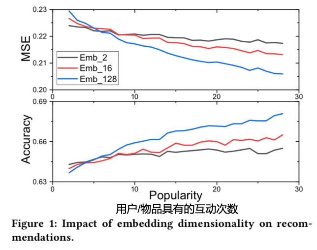

# Title

# Background

深度学习推荐系统（DLRSs）的结构通常由三层Embedding Layer、Hidden Layer和Output Layer三层组成，在Embedding Layer中对于用户和物品的Embedding维度通常是固定的，但作者在实验中发现，不同用户/物品不同的表示维度是必要的。如下图的实验结果所示：

有如下结论：

+ 随着popularity的增加，推荐模型的表现在不同的Embedding维度都有提高，但是越大的Embedding维度
得到更多收益。
+ 在popularity比较小的时候，Embedding维度比较小就可以得到最优的结果，但是之后会被更大的Embedding维度超越

本文据此提出根据popularity和上下文信息来选择用户和物品的Embedding维度的**AutoEmb**
# Problem Statement
对不同用户/物品选择不同维度存在的两个问题：

+ 因为隐层的第一层维度固定，不同的嵌入层表示维度很难输入进隐层，进行训练。

+ 实际场景中用户/物品数目巨大，手工选择维度不太可能。
# Method(s)

对于第一个问题，作者通过对Embedding变换统一维度输入进Hidden Layer。第二个问题作者设计了一个Controller的结构来根据Popularity和上下文信息来选择维度。

1.Embedding Transformation and Selection

## 2.Controller

# Evaluation

作者如何评估自己的方法，有没有问题或者可以借鉴的地方

# Conclusion

作者给了哪些strong conclusion, 又给了哪些weak conclusion?

# Notes

在这些框架外额外需要记录的笔记。
# Link
1.[原文链接][https://arxiv.org/abs/2002.11252]